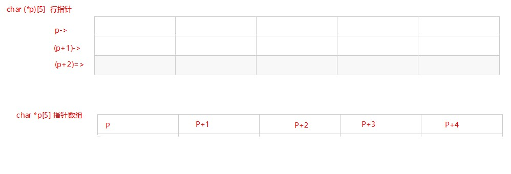

# 

C语言 关于Struct结构的计算问题

1、使用Sizeof("Struct")发现和我们计算的有些出入，为什么会出现这种情况？

关于结构体，Sizeof的计算遵循如下规则：

**(1）结构体变量中成员的偏移量必须是成员大小的整数倍（0被认为是任何数的整数倍）**

**(2）结构体大小必须是所有成员大小的整数倍，也即所有成员大小的公倍数**

偏移量**指的是结构体变量中成员的地址和结构体变量地址的差**。结构体大小**等于最后一个成员的偏移量加上最后一个成员的大小**

C语言 关于指正函数和函数指针的问题

char (*p)[10] 和 char * p[10]的区别，怎么形象的理解他们？

1、数组指针：

char (*p)[10]为数组指针 形象的称其为“行指针”， p+1是跨越10个整型数据的长度

()优先级最高 所以 P表示为一个指针 数量只有一个。

2、指针数组

char *p[10] 为指针数组 []优先级高于*，所以为一组指向char类型的指针数组 数量有10个

类比C++问题，衍生出如下问题：

const char * a[] 和 char * const a[] 的区别？

平铺直叙：

const char * a[] 指向常量char类型的指针 

char * const a[] 指向char类型的常量指针，代码规范上的引起的表意不明的问题。《C++ templates》简介里面提到过

对于 const int N=100 和 int const N=100是等价的，但是对于

int * const N；//指针不能改变但是指针指向的内存值可以改变。

却找不到等价的关系

typedef char* CHARS;

typedef CHARS const CPTR; //指向char类型的   常量指针

变为

typedef const CHARS CPTR; //指向常量	char类型的指针

